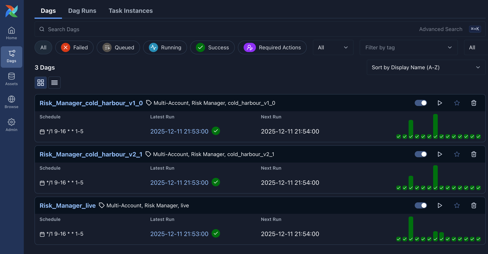

# Risk Manager Service

The **Risk Manager** is an autonomous execution agent designed to eliminate
tail-risk on active bracket orders. It runs as a scheduled DAG in Airflow,
continuously monitoring price action against pre-calculated volatility targets.

## Core Logic: The "Break-Even" Mechanism

The primary goal is to move the Stop Loss to the **Entry Price**
(Break-Even) once the position has moved sufficiently in our favor.

### The Trigger: "TakeProfit 2"
The system uses a volatility-adjusted trigger based on the **Risk Multiple
(R)**.
- **R (Risk Unit):** The distance between `Entry Price` and the initial
  `Stop Loss`.
- **Trigger Condition:** The break-even logic activates when the price
  reaches **2R** (i.e., `Entry + 2 * Risk`).

This level is pre-calculated by the breakout engine and stored in the
`alpaca_breakouts` table as `takeprofit_2_1_price`.

| Parameter | Value | Description |
|-----------|-------|-------------|
| **Trigger Source** | `takeprofit_2_1_price` | The price level that "arms" the move. |
| **Move Target** | `Entry Price` | The new `stop_price` applied to the order. |
| **Min Gap** | `0.01` (or tick size) | Ensures the new stop is valid and accepted by the broker. |

### Decision Matrix
Every minute, the manager evaluates each open position against the following
logic steps:

| Step | Condition | Action / Outcome |
|:---:|:--- |:--- |
| **1** | `Current Stop ~= Entry` | **SKIP**: Position is already at Break-Even. |
| **2** | `Last Trade` is missing | **SKIP**: Market data unavailable. |
| **3** | `Last Trade < Entry` (Long) | **ABORT**: Price has fallen back below entry. Moving stop now would trigger an immediate loss. |
| **4** | `Max High >= Trigger` (Long) | **ARMED**: The asset touched the 2.1R target. |
| **5** | All checks pass | **EXECUTE**: Send `PATCH /v2/orders/{id}` to move stop to Entry. |

---

## Data Resiliency & Fallbacks

The Risk Manager is designed to function even if the local database is lagging
or empty. It implements a **Tiered Loading Strategy** in
`_fetch_portfolio_state`:

### 1. Primary Source: Local Database
* **Attempt:** Query `account_activities.raw_orders_<slug>`.
* **Pros:** Extremely fast, low latency, reduces API rate limits.
* **Cons:** Depends on the Ingester service being up-to-date.

### 2. Fallback Source: Alpaca REST API
* **Trigger:** If the Local Database returns **0 active orders**.
* **Action:** The manager bypasses the DB and downloads the full order
  history directly from Alpaca.
* **Optimization:** To avoid downloading years of history, it checks
  `raw_history_meta` to find the exact account start date.

| Priority | Source | Mechanism |
|:---:|:--- |:--- |
| **A** | **DB Meta** | Checks `earliest_order` timestamp in `raw_history_meta`. |
| **B** | **API Probe** | If meta is missing, queries Alpaca for the very first order to define the window. |
| **C** | **Default** | Defaults to `365 days` lookback as a safety net. |

---

## Infrastructure

* **DAG Definition:** `dags/breakeven_multi_account.py`
* **Schedule:** `*/1 9-16 * * 1-5` (Every minute during NYSE Regular Trading Hours).
* **Concurrency:** Uses a `ThreadPoolExecutor` (default 10 workers) to
  parallelize market data fetches and patch requests across hundreds of
  positions.
* **Audit Logging:** All decisions (including "Why I skipped this trade") are
  persisted to the `log_breakeven_<slug>` table for debugging.
